# SIEM TUTORIAL | Microsoft Sentinel HeatMAP with LIVE CYBER ATTACKS (put this on your resume)
### Learning Objectives:
1. Provisioning and deprovisioning virtual enviornments within Azure.
2. Third-party API calls.
3. Security Information and Event Management - log anaylyis and visualization. 
> NOTE: Since we will utilize RDP you will need a Windows host machine - a Windows virtual machine will also work.

### Technologies and Protocols:
* Microsft Azure - a cloud computing service operated by Microsoft for application management via Microsoft-managed data centers
* Services within Azure: Log Analytics Workspace and Sentinel (Mircosoft's SIEM)
* Powershell 
* Remote desktop protocol
 
### Overview:
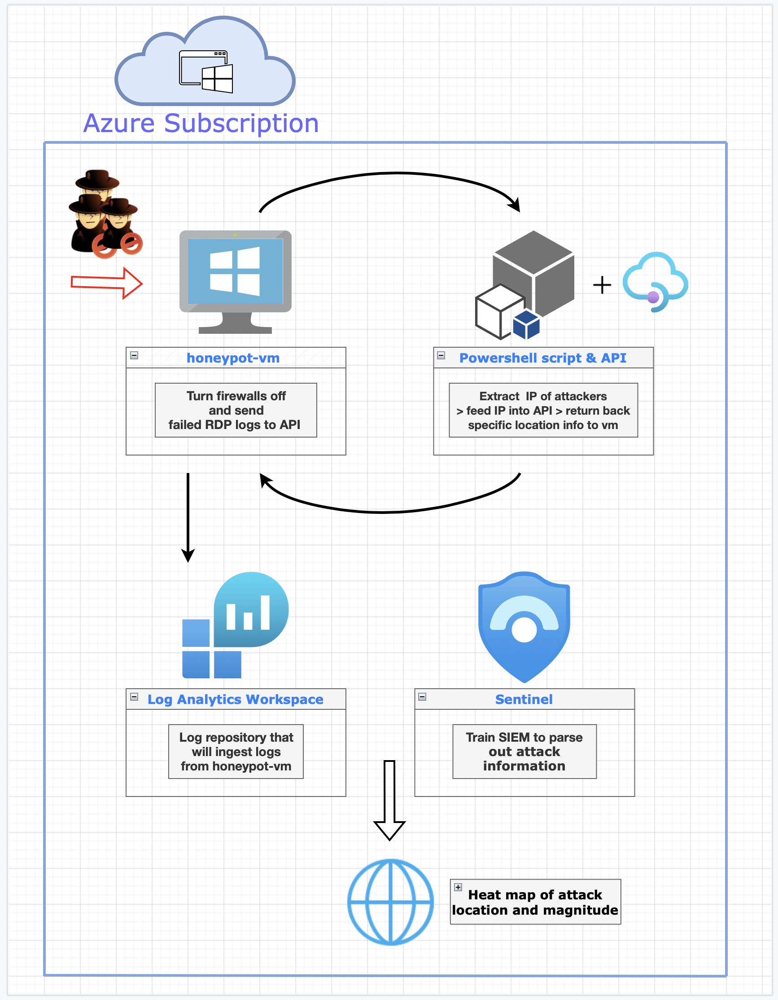

> Step-by-step overview of lab:
1. Create Azure subscription (FREE $200 credits)
2. Create virtual machine in Azure (honeypot-vm) > turn firewalls off (making it vulnerable to brute force attacks) 
3. Use a Powershell script to extract  IP of attackers > feed IP into third party API and return back to honeypot-vm specific location information.
4.  Create log repository in Azure (Log Analytics Workspace) - this will ingest our logs from honeypot-vm
5. Set up Sentinel - Microsoft’s cloud native SIEM
6. Use data from SIEM to map out attacker information and magnitude 

## Step 1: Create FREE Azure account: [Azure](https://azure.microsoft.com/en-us/free/ "Azure")
- Click on “Go to the Azure Portal” or go to `portal.azure.com` once you create your account.

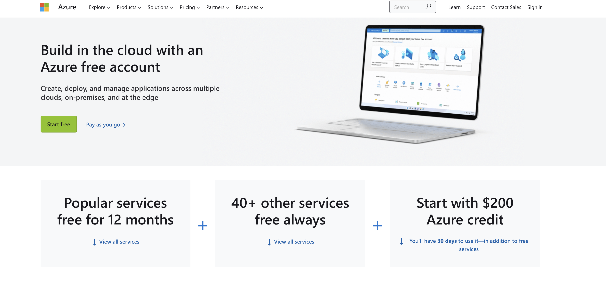

## Step 2: Create our honey pot virtual machine
- In the search bar of the “Quickstart Center” page > search and click virtual machine 
- This will be the honey pot virtual machine made to entice attackers from all over the world

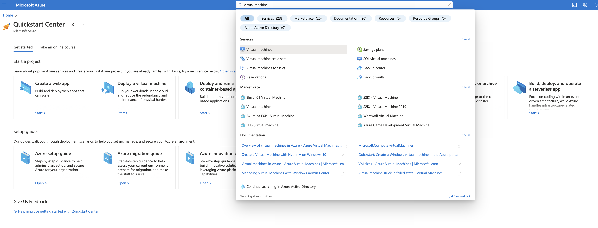

## Step 3: On the “virtual machines” page click Create > Azure virtual machine 
- Edit the virtual machine as follows:
- Click create new under resource group and name it honeypotlab (this resource group is a logical grouping of similar resources)
- Name the virtual machine: honeypot-vm
- Under region select: (US) East US 2 
- Under Image select: Windows 10 pro, version 21H2 - Gen2
- Availability zone: Zones 2 (**screenshot is incorrect; choose Zones 2**)
- Under size: Standard_D2as_v4 - 2 vcpus, 8 GiB memory
- Create a username and password - **don’t forget credentials**
- Finally, check confirm box - leaving the rest in their default options  

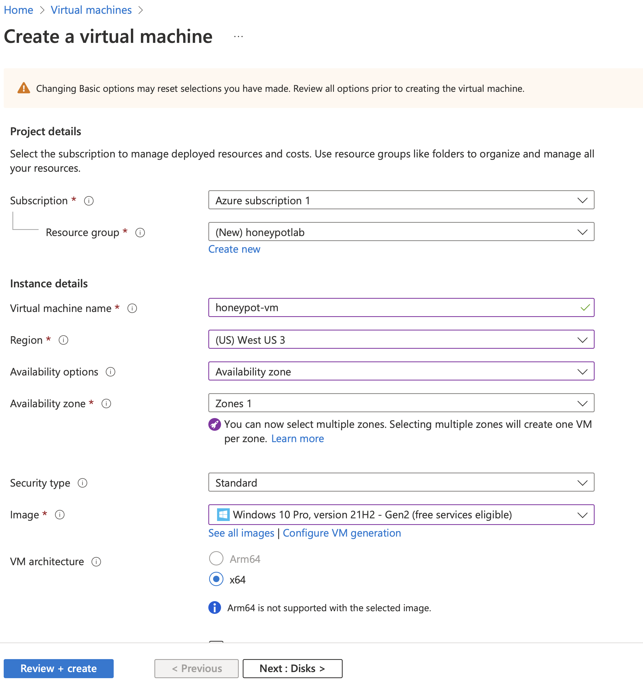

## Step 4: Click > Next: Disk but leave it as is, click to continue to Networking
-  Under *NIC network security group* select > Advance and under *Configure network security group* select Create new
- You should see a default rule (something like 1000: default-allow-rdp), click the three dots to the right of it and **remove** it.
- Select *Add an inbound rule* 
- Match the settings of the new rule as follows: 
- Set *Destination port ranges*: * 
- Priority: 100
- Name: DANGER_ANY_INBOUND
- Leave the rest of the settings as default
- Click Add > OK > Review + create - wait a bit to load and click Create

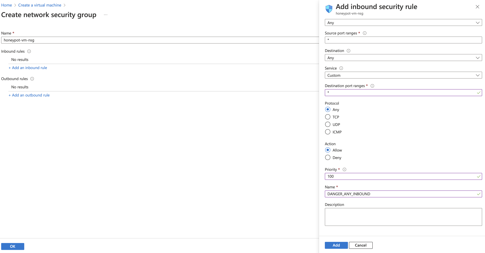

> The point of this new firewall rule is to allow any traffic from anywhere.  This will make our virtual machine very discoverable. 

## Step 5: Create Log Analytics workspace
- As we wait for our vm to deploy, go back to the search bar and search and click *Log Analytics workspaces*

> The purpose  of this workspace is to ingest logs from our vm. Additionally, we will create our own custom logs that will contain geographic information on who is attacking us. Later, our MS SIEM will feed logs into here.

- Select the blue Create log analytics workspace button
- Under the Basics tab:
- Resource source group: honeypot—lab
- Name: law-honeypot1
- Region: West US 2 (**screenshot is incorrect; choose West US 2**)
- Click Review + Create and click Create

## Step 6A: Enable log collection from vm to log workspace
- Back in the search bar search and click *Microsoft Defender for Cloud*
- Once on the dashboard click > Environment Settings > (through the drop down menus) > law-honeypot1

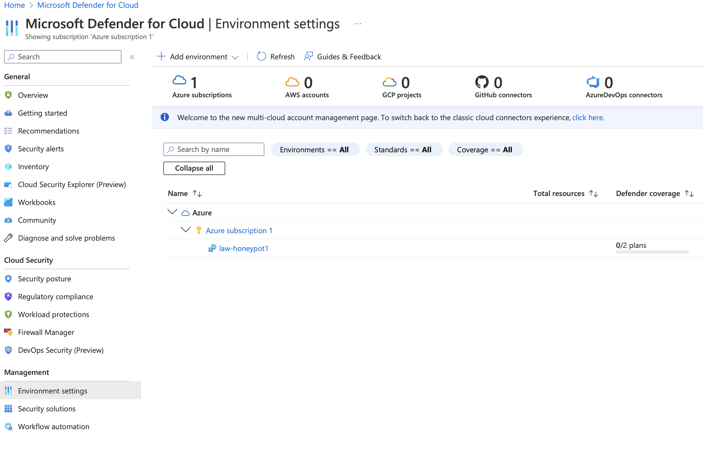

## Step 6B: Under law-honeypot1 select *Defender Plans* and enable *Servers* ON and *SQL servers on machines* OFF. With *Cloud Security Posture Management* ON. Hit save.
- Under *Data Collection* tab select *All Events*. Hit save.

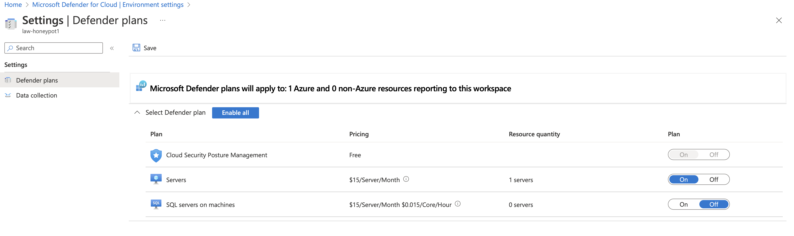

## Step 7: connect Log Analytics workspace to our vm
- On the search bar select Log Analytics workspace
- Select law-honeypot1 > Virtual Machines > honeypot-vm
- Click **connect**, after clicking honeypot-vm
- It will take some time to successfully connect; you should get a message confirming connection.

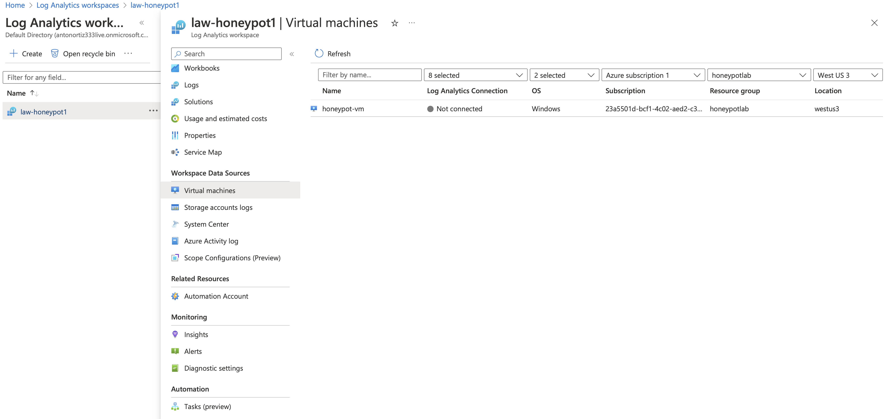

## Step 8: Add Microsoft Sentinel to our workspace 
- In search bar find **Microsoft Sentinel**
- Click Create Microsoft Sentinel > select law-honeypot1 > Add
- This will also take some time

## Step 9A: Log into vm through host machine
- Through the search bar, find our honeypot-vm > copy the Public IP address (highlighted here on the right)

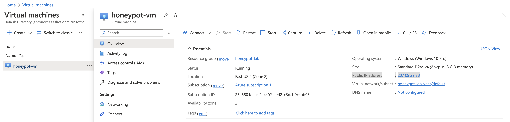

## Step 9B: RDP from host Windows machine
- On your Windows machine (Windows vm will also work) search and open *Remote Desktop Connection*
- Paste your Azure IP into *Computer*
- Before connecting, click Display and scale down display configuration for easier viewing
- Click connect
- In the *Enter your credentials* window click more choices > Use a different account 
- Enter invalid credentials tin order to generate a log for later viewing.
- Then, enter your credentials we created for our Azure vm in Step 3, click OK.
- Accept the certificate warning
- You should be logged into the vm when you see “Remote Desktop Connection” at the top of the screen.

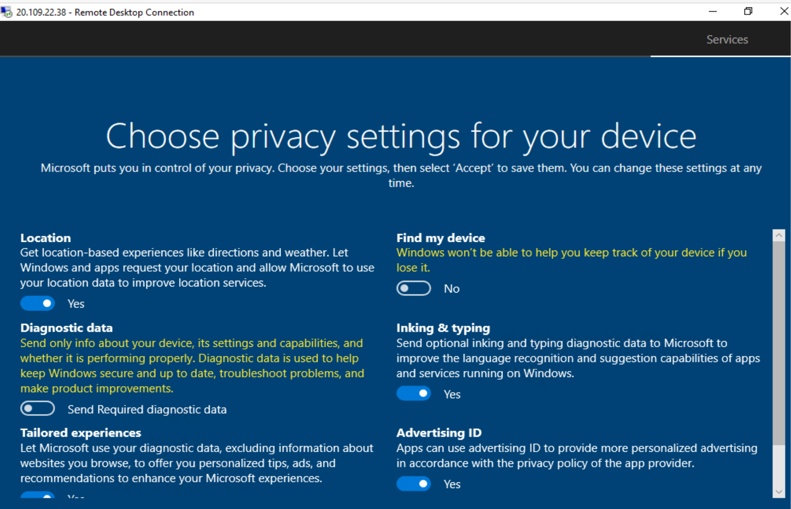

## Step 10A: Set up vm and explore 
- Click NO to all privacy settings and Accept
- Set up Edge
- Search and click *Event Viewer*
- Click Windows Logs > Security and find the Audit Failure log (our failed login attempt; if you don’t see it at first filter current log by “Audit Failure” found to the left)

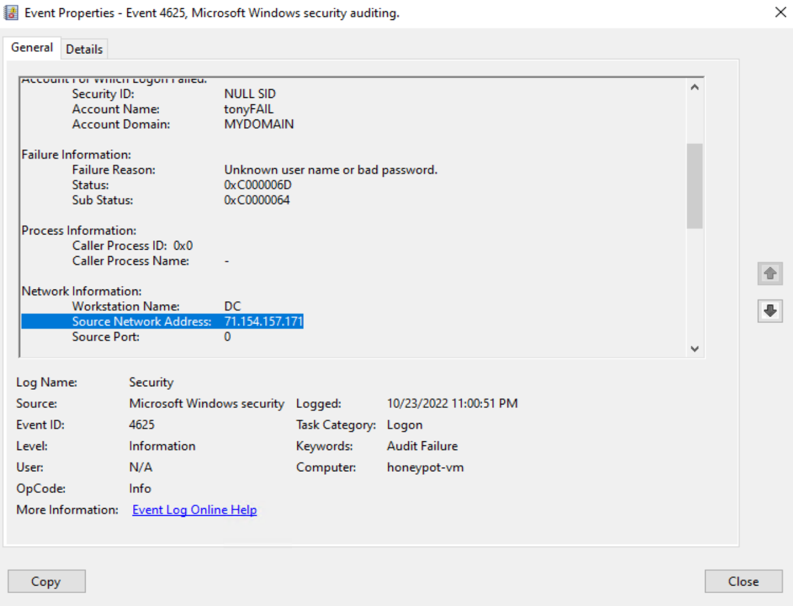

> The Source Network Address will represent the attacker’s IPs and eventually where on Earth they are attacking us!
> But in order to do this we need to send this network address to a third party API… but more on that later.

## Step 10B: Turn off firewall to make vm more susceptible to attack 
- Open command prompt on your **host** machine and try to ping the Azure vm - it shouldn’t work!
- Search and open wf.msc on Azure vm - *remember* to keep an eye on vm IP at the very top to confirm you’re in the vm and NOT in on your host to avoid confusion.
- Click Windows Defender Firewall Properties near the middle of the page
- Under the Domain Profile > Firewall state: OFF
- Under Private Profile > Firewall state: OFF
- Under Public Profile > Firewall state: OFF
- Try to ping vm again from your **host** machine - this should now work!

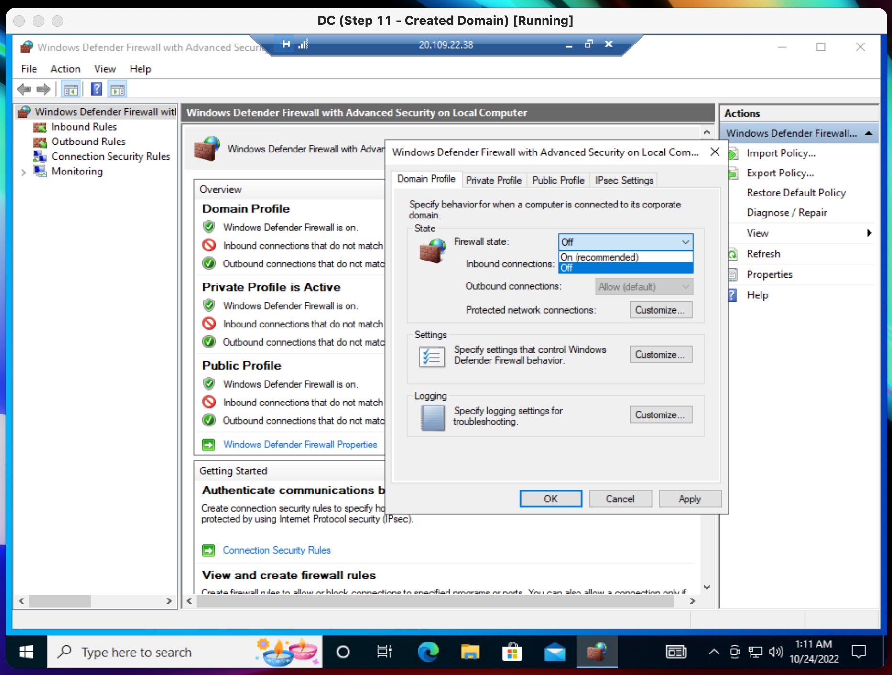

## Step 11A: Retrieve Powershell script: [Script](https://github.com/joshmadakor1/Sentinel-Lab/blob/main/Custom_Security_Log_Exporter.ps1 "Script")
- Open Powershell ISE
- For convenience you can copy/paste the code into a new ps1 file and save it to the desktop of the **honeypot-vm** (remember to see vm IP at the top)
- You will also need an API key, get here: [API key](https://ipgeolocation.io/ "API key")
- Create an account and log in
- Copy and paste *your* API key in your Powershell script `$API_KEY = “_your API key_”`
- Save file.

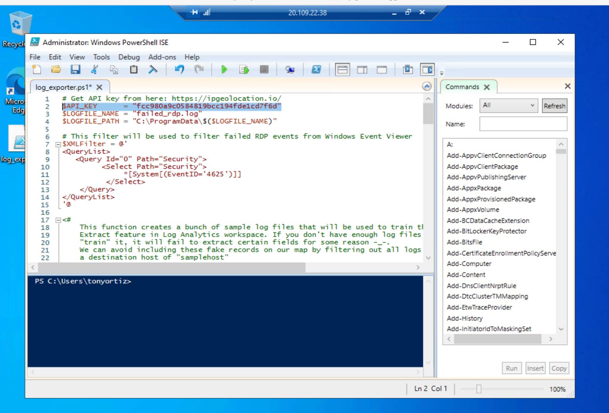

> Quick explanation of script: the script will parse through the security event logs (Audit Failure/failed login logs we looked at earlier) and grab IP information. The script then **passes** the IP thorough the API and correlates the info into longitude and latitude, giving us specific geographical information. 

## Step 11B: Powershell script (cont.)
- Test and run the script pass pressing green play button at top of window 
- You should receive purple logs indicating latitude / latitude of failed logins (some sample logs and some log when we failed to log in)
> NOTE: Keep Powershell script running in the backgroup. We need to continously feed our log repository information.

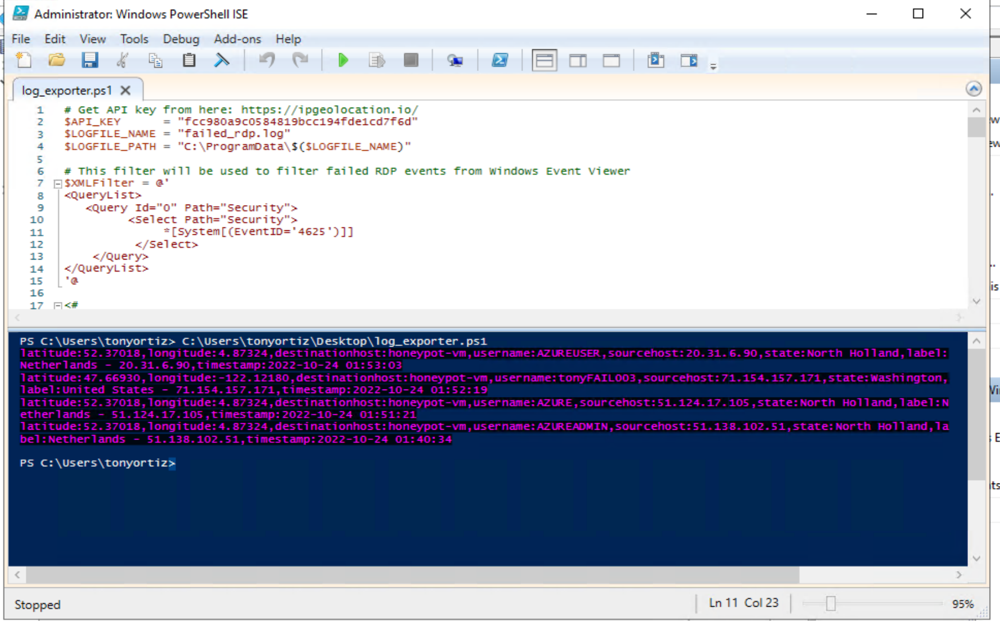

## Step 12A: Create custom geolocation log in Log Analytics Workspace.
- This log will use IP information to give us specific geolocation to our create map down the line.
- Search and click Log Analytics Workspace > law-honeypot1 > custom logs > + Add custom log
- We need to upload a sample log to “train” log analytics on what to look for.

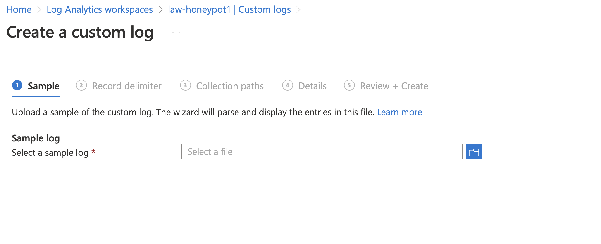

## Step 12B: Custom geolocation log (cont.)
- Our sample logs are in our **honeypot-vm**.
- **In our honeypot-vm**, search RUN > search C:\ProgramData\ and open the failed_rdp file.
- Our failed RDP logins are sent to this txt file, open and copy all the sample logs. 
- Back on our **host machine**, open notes and paste our sample logs.
- Save the file in a log or txt format and upload it in the *Create a custom log* page. Click next and you should see the sample logs.

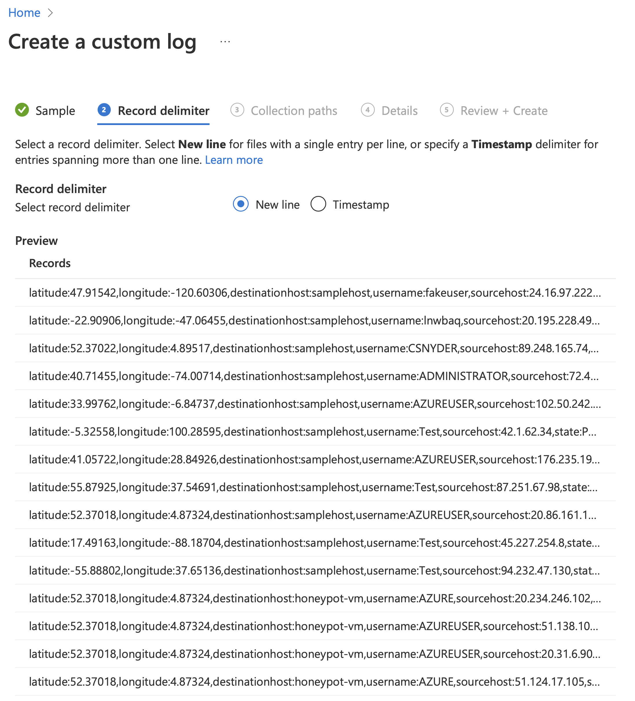

## Step 12C: Click next and under Collection Paths > under Type > Windows, under Path write C:\ProgramData\failed_rdp.log

## Step 12D: Click next > under Details > Custom log name write FAILED_RDP_WITH_GEO (CL will be added to the end)
- Click next > Create >Review + Create
- Let’s go back to log analytics and check if Azure is connected and listening to our vm.

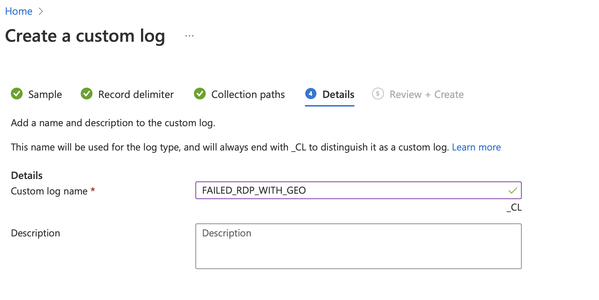

## Step 12E: Secure connection between honeypot-vm and log analytics 
- Under law-honeypot1 > General > Logs > search SecurityEvent and click blue Run button.
- Give it a moment, and voila! It returns the same security logs window from our honeypot-vm’s Event Viewer.
- Give it some time and search our custom: `FAILED_RDP_WITH_GEO_CL will` it will return our sample logs.

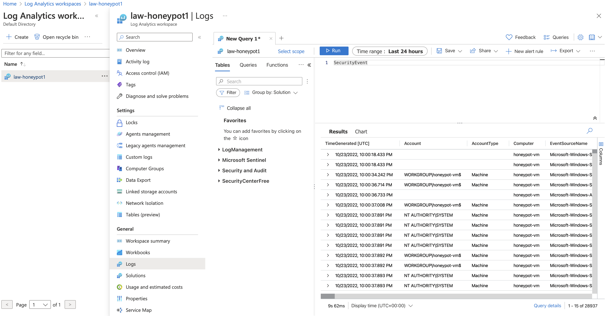
 
## Step 13A: Overview: Extract geo-data from the RawData of our sample logs.
- Take a look at our sample logs in our FAILED_RDP_WITH_GEO_CL.
- In the RawData columns we find information like longitude, latitude, destination host, etc.
- We need to categorize longitude, latitude, destination host, etc. **values** from the raw data before we can obtain  geolocation data.
- It sounds a bit abstract now, but bare with me.
> NOTE: If you step away and come back to this lab after a day or two make sure to change the *Time range* accordingly. 

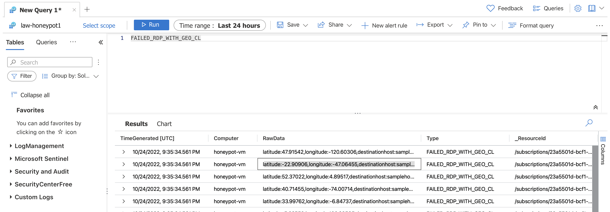

## Step 13B: Extract and categorize data from sample log
- Right-click the first log you see in the search results and click Extract Fields from FAILED_RDP_WITH_GEO_CL
- Under Main Example highlight the latitude VALUE - not the word ‘latitude’ itself
- A window will automatically pop-up
- Under Field value type latitude and under Filed type choose numeric, click Extract
- To the right, check that the SIEM is selecting the correct values on each sample log.
- Click save extraction. 

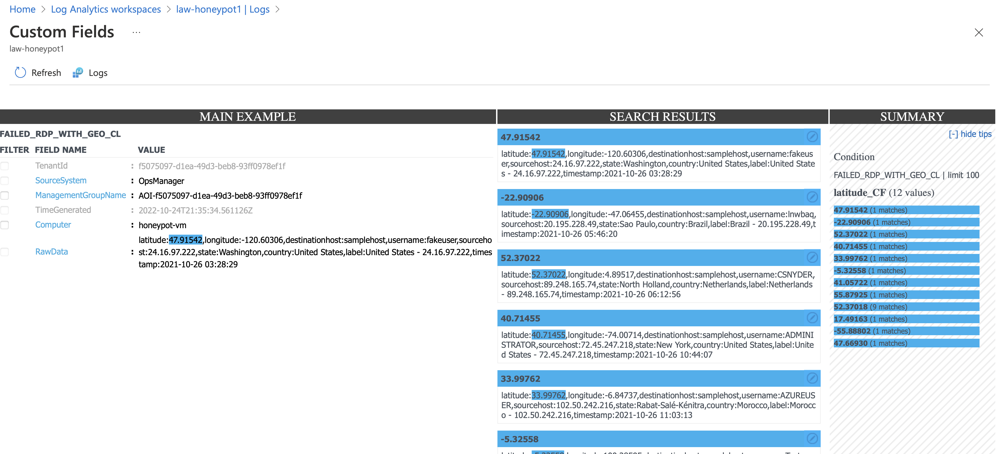

> This is an important step because we are ‘training’ our SIEM what to look out for. 

## Step 13C: Extracting more data from sample log
- Same process, different values.
- Right-click the same log > Extract files from… 
- Now this time highlight *longitude value*
- Field value: longitude > filed type: numeric, click Extract
- Inside our search results it looks like our SIEM needs some help because it highlighted latitude when we were asking for LONGITUDE (bad siem).
- Worry not: this is where some corrective training comes into play.
- Click the little pencil within a circle icon at the top-right of the incorrect search result.
- Click modify this highlight and highlight the **longitude** value once more.
- Again: Field value: longitude > filed type: numeric, click Extract
- Take a look at the search result, it should now highlight the correct longitude value.
- Continue to train our SIEM and correct a few more search results.

## Step 13D: Even more data extraction from sample log!
- The same process to when we extracted latitude and longitude values.
- Remember to highlight the *vaules* and to select the correct field value and field type
- Right-click the same log > Extract files from… 
- Highlight destination host value > filed title: destinationhost > type: text 
- Re-select vales if needed and save
- Remember to save after each selection - you can’t select more than one value at a time
- Highlight user name value > filed title: username > type: text 
- Highlight source host value > filed title: sourcehost > type: text 
- Highlight state value > filed title: state > type: text 
- Highlight country value > filed title: country > type: text 
- Highlight label value > filed title: label > type: text 
- Highlight timestamp value > filed title: timestamp > type: Date/Time
- Hit save extraction for the final time and we’re done extracting!
- Under setting columns to the left click Custom Logs > Custom fields
- Your custom fields we just made should look something like this:

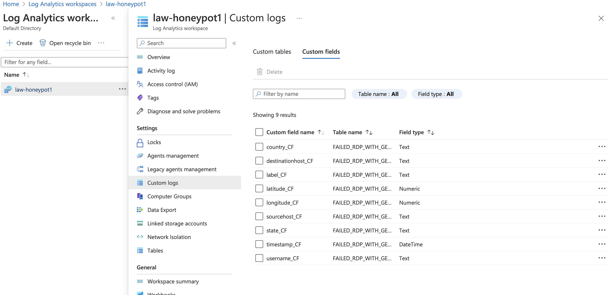

> A couple of notes before moving on: **make sure our Powershell script log_exporter.log is running**. The script will continue to feed our SIEM with fresh new logs. 

> After extracting the data from our logs, you may or may not already see people trying to RDP into our vm (!). Give it some time.

## Step 14A : Set up our map within Microsoft Sentinel 
- Next, we will map out our logs within Sentinel with the extracted data - to see where in the world is our vm is being attacked from.
- Search and click Microsoft Sentinel > choose law-honeypot1 and under Threat management choose *Workbooks* > click + Add workbook
- Click edit > click the “ … “ on the right side on the screen and remove the two widgets.
- Click Add > Add query and paste the following into the query:

`FAILED_RDP_WITH_GEO_CL | summarize event_count=count() by sourcehost_CF, latitude_CF, longitude_CF, country_CF, label_CF, destinationhost_CF
| where destinationhost_CF != "samplehost"
| where sourcehost_CF != ""`

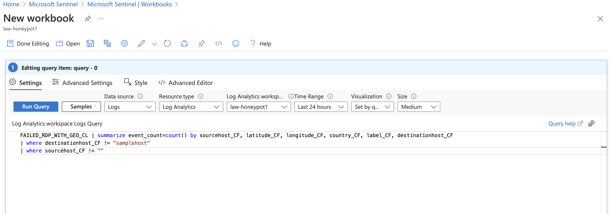

> This will parse through the failed RDP’s logs and return to us location information through our custom fields we created.

> The last two lines will ensure we DON’T receive anything with sample host or anything blank.

