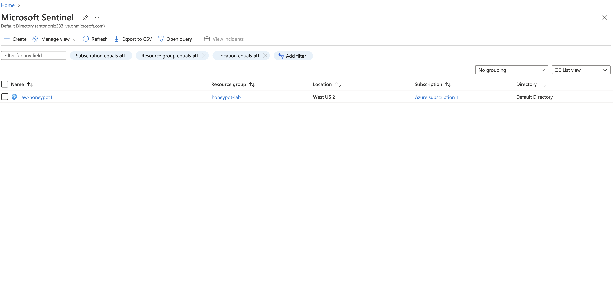

# SIEM TUTORIAL | Microsoft Sentinel HeatMAP with LIVE CYBER ATTACKS (put this on your resume)
### Learning Objectives:
1. Provisioning and deprovisioning virtual enviornments within Azure.
2. Third-party API calls.
3. Security Information and Event Management - log anaylyis and visualization. 
> NOTE: Since we will utilize RDP you will need a Windows host machine - a Windows virtual machine will also work.

### Technologies and Protocols:
* Microsft Azure - a cloud computing service operated by Microsoft for application management via Microsoft-managed data centers
* Services within Azure: Log Analytics Workspace and Sentinel (Mircosoft's SIEM)
* Powershell 
* Remote desktop protocol
 
### Overview:

> Step-by-step overview of lab:
1. Create Azure subscription (FREE $200 credits)
2. Create virtual machine in Azure (honeypot-vm) > turn firewalls off (making it vulnerable to brute force attacks) 
3. Use a Powershell script to extract  IP of attackers > feed IP into third party API and return back to honeypot-vm specific location information.
4.  Create log repository in Azure (Log Analytics Workspace) - this will ingest our logs from honeypot-vm
5. Set up Sentinel - Microsoft’s cloud native SIEM
6. Use data from SIEM to map out attacker information and magnitude 

## Step 1: Create FREE Azure account: [Azure](https://azure.microsoft.com/en-us/free/ "Azure")
- Click on “Go to the Azure Portal” or go to `portal.azure.com` once you create your account.

## Step 2: Create our honey pot virtual machine
- In the search bar of the “Quickstart Center” page > search and click virtual machine 
- This will be the honey pot virtual machine made to entice attackers from all over the world

## Step 3: On the “virtual machines” page click Create > Azure virtual machine 
- Edit the virtual machine as follows:
- Click create new under resource group and name it honeypotlab (this resource group is a logical grouping of similar resources)
- Name the virtual machine: honeypot-vm
- Under region select: (US) East US 2 
- Under Image select: Windows 10 pro, version 21H2 - Gen2
- Availability zone: Zones 2 (**screenshot is incorrect; choose Zones 2**)
- Under size: Standard_D2as_v4 - 2 vcpus, 8 GiB memory
- Create a username and password - **don’t forget credentials**
- Finally, check confirm box - leaving the rest in their default options  

## Step 4: Click > Next: Disk but leave it as is, click to continue to Networking
-  Under *NIC network security group* select > Advance and under *Configure network security group* select Create new
- You should see a default rule (something like 1000: default-allow-rdp), click the three dots to the right of it and **remove** it.
- Select *Add an inbound rule* 
- Match the settings of the new rule as follows: 
- Set *Destination port ranges*: * 
- Priority: 100
- Name: DANGER_ANY_INBOUND
- Leave the rest of the settings as default
- Click Add > OK > Review + create - wait a bit to load and click Create

> The point of this new firewall rule is to allow any traffic from anywhere.  This will make our virtual machine very discoverable. 

## Step 5: Create Log Analytics workspace
- As we wait for our vm to deploy, go back to the search bar and search and click *Log Analytics workspaces*

> The purpose  of this workspace is to ingest logs from our vm. Additionally, we will create our own custom logs that will contain geographic information on who is attacking us. Later, our MS SIEM will feed logs into here.

- Select the blue Create log analytics workspace button
- Under the Basics tab:
- Resource source group: honeypot—lab
- Name: law-honeypot1
- Region: West US 2 (**screenshot is incorrect; choose West US 2**)
- Click Review + Create and click Create

## Step 6A: Enable log collection from vm to log workspace
- Back in the search bar search and click *Microsoft Defender for Cloud*
- Once on the dashboard click > Environment Settings > (through the drop down menus) > law-honeypot1

## Step 6B: Under law-honeypot1 select *Defender Plans* and enable *Servers* ON and *SQL servers on machines* OFF. With *Cloud Security Posture Management* ON. Hit save.
- Under *Data Collection* tab select *All Events*. Hit save.

## Step 7: connect Log Analytics workspace to our vm
- On the search bar select Log Analytics workspace
- Select law-honeypot1 > Virtual Machines > honeypot-vm
- Click **connect**, after clicking honeypot-vm
- It will take some time to successfully connect; you should get a message confirming connection.

## Step 8: Add Microsoft Sentinel to our workspace 
- In search bar find **Microsoft Sentinel**
- Click Create Microsoft Sentinel > select law-honeypot1 > Add
- This will also take some time

## Step 9A: Log into vm through host machine
- Through the search bar, find our honeypot-vm > copy the Public IP address (highlighted here on the right)

## Step 9B: RDP from host Windows machine
- On your Windows machine (Windows vm will also work) search and open *Remote Desktop Connection*
- Paste your Azure IP into *Computer*
- Before connecting, click Display and scale down display configuration for easier viewing
- Click connect
- In the *Enter your credentials* window click more choices > Use a different account 
- Enter invalid credentials tin order to generate a log for later viewing.
- Then, enter your credentials we created for our Azure vm in Step 3, click OK.
- Accept the certificate warning
- You should be logged into the vm when you see “Remote Desktop Connection” at the top of the screen.

## Step 10A: Set up vm and explore 
- Click NO to all privacy settings and Accept
- Set up Edge
- Search and click *Event Viewer*
- Click Windows Logs > Security and find the Audit Failure log (our failed login attempt; if you don’t see it at first filter current log by “Audit Failure” found to the left)

> The Source Network Address will represent the attacker’s IPs and eventually where on Earth they are attacking us!
> But in order to do this we need to send this network address to a third party API… but more on that later.

## Step 10B: Turn off firewall to make vm more susceptible to attack 
- Open command prompt on your **host** machine and try to ping the Azure vm - it shouldn’t work!
- Search and open wf.msc on Azure vm - *remember* to keep an eye on vm IP at the very top to confirm you’re in the vm and NOT in on your host to avoid confusion.
- Click Windows Defender Firewall Properties near the middle of the page
- Under the Domain Profile > Firewall state: OFF
- Under Private Profile > Firewall state: OFF
- Under Public Profile > Firewall state: OFF
- Try to ping vm again from your **host** machine - this should now work!

