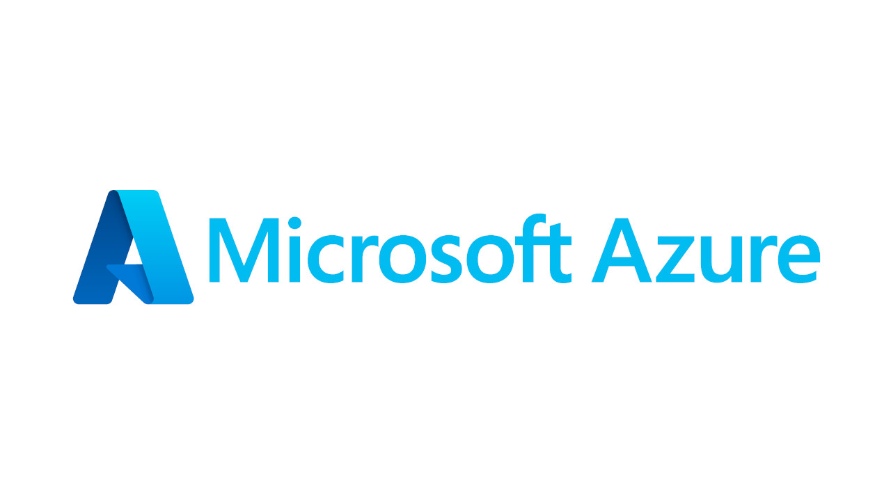

# SIEM TUTORIAL | Microsoft Sentinel HeatMAP with LIVE CYBER ATTACKS (put this on your resume)
### Learning Objectives:
1. Provisioning and deprovisioning virtual enviornments within Azure.
2. Third-party API calls.
3. Security Information and Event Management - log anaylyis and visualization. 

### Technologies and Protocols:
* Microsft Azure - a cloud computing service operated by Microsoft for application management via Microsoft-managed data centers
* Services within Azure: Log Analytics Workspace and Sentinel (Mircosoft's SIEM)
* Powershell 
 
### Overview:

> Step-by-step overview of lab:
1. Create Azure subscription (FREE $200 credits)
2. Create virtual machine in Azure (honeypot-vm) > turn firewalls off (making it vulnerable to brute force attacks) 
3. Use a Powershell script to extract  IP of attackers > feed IP into third party API and return back to honeypot-vm specific location information.
4.  Create log repository in Azure (Log Analytics Workspace) - this will ingest our logs from honeypot-vm
5. Set up Sentinel - Microsoft’s cloud native SIEM
6. Use data from SIEM to map out attacker information and magnitude 

## Step 1: Create FREE Azure account: [Azure](https://azure.microsoft.com/en-us/free/ "Azure")
- Click on “Go to the Azure Portal” or go to `portal.azure.com` once you create your account.

## Step 2: Create our honey pot virtual machine
- In the search bar of the “Quickstart Center” page > search and click virtual machine 
- This will be the honey pot virtual machine made to entice attackers from all over the world

## Step 3: On the “virtual machines” page click Create > Azure virtual machine 
- Edit the virtual machine as follows:
- Click create new under resource group and name it honeypotlab (this resource group is a logical grouping of similar resources)
- Name the virtual machine: honeypot-vm
- Under region select: (US) East US 2 
- Under Image select: Windows 10 pro, version 21H2 - Gen2
- Availability zone: Zones 2 (**screenshot is incorrect; choose Zones 2**)
- Under size: Standard_D2as_v4 - 2 vcpus, 8 GiB memory
- Create a username and password - **don’t forget credentials**
- Finally, check confirm box - leaving the rest in their default options  

## Step 4:  Turning firewall off: Click > Next: Disk but leave it as is, click to continue to Networking
-  Under *NIC network security group* select > Advance and under *Configure network security group* select Create new
- You should see a default rule (something like 1000: default-allow-rdp), click the three dots to the right of it and **remove** it.
- Select *Add an inbound rule* 
- Match the settings of the new rule as follows: 
- Set *Destination port ranges*: * 
- Priority: 100
- Name: DANGER_ANY_INBOUND
- Leave the rest of the settings as default
- Click Add > OK > Review + create - wait a bit to load and click Create

> The point of this new firewall rule is to allow any traffic from anywhere.  This will make our virtual machine very discoverable. 

## Step 5: Create Log Analytics workspace
- As we wait for our vm to deploy, go back to the search bar and search and click *Log Analytics workspaces*

> The purpose  of this workspace is to ingest logs from our vm. Additionally, we will create our own custom logs that will contain geographic information on who is attacking us. Later, our MS SIEM will feed logs into here.

- Select the blue Create log analytics workspace button
- Under the Basics tab:
- Resource source group: honeypot—lab
- Name: law-honeypot1
- Region: West US 2 (**screenshot is incorrect; choose West US 2**)
- Click Review + Create and click Create

## Step 6A: Enable log collection from vm to log workspace
- Back in the search bar search and click *Microsoft Defender for Cloud*
- Once on the dashboard click > Environment Settings > (through the drop down menus) > law-honeypot1

